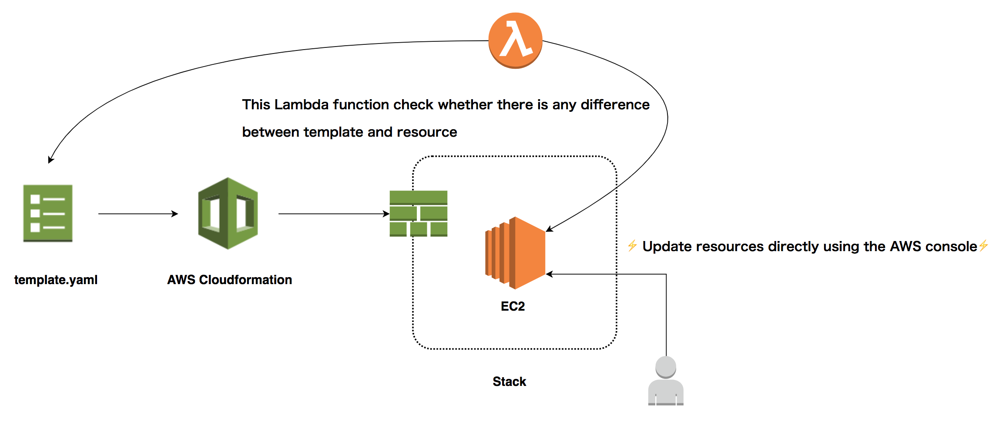

# About Function

This funciton detects whether Cloudformation's Stack-related resource has been changed from the AWS console.



It starts every day at 10 o'clock and executes the detect_stack_drift API for all stacks.

# License

MIT License (MIT)

This software is released under the MIT License, see LICENSE.txt.

# Packages

```bash
.
├── README.md                   <-- This instructions file
├── detect_stack_drift          <-- Source code for a lambda function
│   ├── __init__.py
│   └── detect_stack_drift.py   <-- Lambda function code
├── requirements.txt            <-- Python dependencies
├── template.yaml               <-- SAM template
└── tests                       <-- Unit tests
    └── unit
        ├── __init__.py
        └── test_handler.py
```

## Requirements

* AWS CLI already configured with at least PowerUser permission
* [Python 3 installed](https://www.python.org/downloads/)
* [Docker installed](https://www.docker.com/community-edition)
* [Python Virtual Environment](http://docs.python-guide.org/en/latest/dev/virtualenvs/)

## Setup process

### Installing dependencies

[AWS Lambda requires a flat folder](https://docs.aws.amazon.com/lambda/latest/dg/lambda-python-how-to-create-deployment-package.html) with the application as well as its dependencies. Therefore, we need to have a 2 step process in order to enable local testing as well as packaging/deployment later on - This consist of two commands you can run as follows:

```bash
pip install -r requirements.txt -t hello_world/build/
cp detect_stack_drift/*.py detect_stack_drift/build/
```

1. Step 1 install our dependencies into ``build`` folder
2. Step 2 copies our application into ``build`` folder

**NOTE:** As you change your application code as well as dependencies during development you'll need to make sure these steps are repeated in order to execute your Lambda and/or API Gateway locally.

# Appendix

### Python Virtual environment
**In case you're new to this**, python3 comes with `virtualenv` library by default so you can simply run the following:

1. Create a new virtual environment
2. Install dependencies in the new virtual environment

```bash
python3 -m venv .venv
. .venv/bin/activate
pip install -r requirements.txt
```


**NOTE:** You can find more information about Virtual Environment at [Python Official Docs here](https://docs.python.org/3/tutorial/venv.html). Alternatively, you may want to look at [Pipenv](https://github.com/pypa/pipenv) as the new way of setting up development workflows
## AWS CLI commands

AWS CLI commands to package, deploy and describe outputs defined within the cloudformation stack:

```bash
sam package \
    --template-file template.yaml \
    --output-template-file packaged.yaml \
    --s3-bucket REPLACE_THIS_WITH_YOUR_S3_BUCKET_NAME

sam deploy \
    --template-file packaged.yaml \
    --stack-name lambda \
    --capabilities CAPABILITY_IAM \
    --parameter-overrides MyParameterSample=MySampleValue

aws cloudformation describe-stacks \
    --stack-name lambda --query 'Stacks[].Outputs'
```
